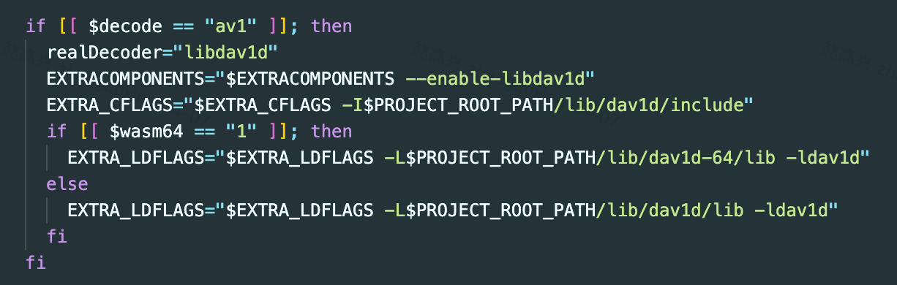
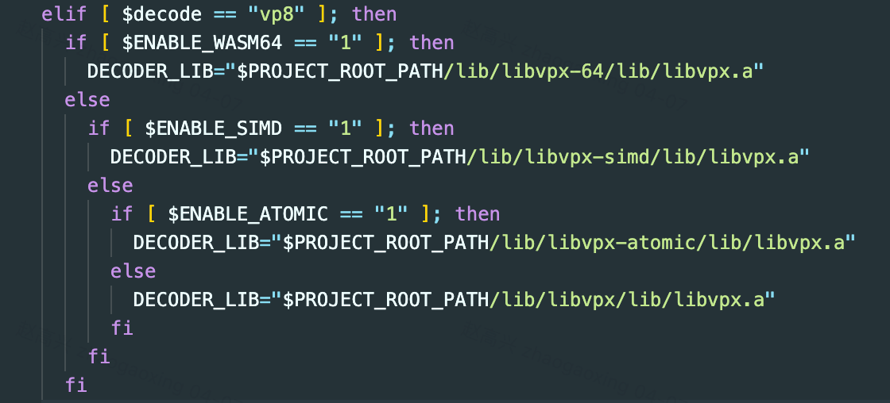

---
nav:
  title: Guide
  order: 2
group:
  title: Other
order: 4
---

# Compile Wasm Codec

At present, libmedia has compiled some common audio and video codecs. If you need to support unsupported encoding formats, you can compile them manually from FFmpeg according to the following steps.

## Environment Preparation

The compilation system is recommended to use MacOS or Linux. Windows uses WSL to compile

1. Install the emscripten compilation tool emsdk. The specific installation steps follow the [official website](https://emscripten.org/docs/getting_started/downloads.html#platform-notes-installation-instructions-sdk)

2. Install the make toolchain according to your system, search for how to install and verify it yourself(If you already have it on your system, skip this step)

3. Clone FFmpeg, use the libmedia customized [repository](https://github.com/zhaohappy/FFmpeg), and switch to the ```libmedia7.0``` branch

```shell
git clone https://github.com/zhaohappy/FFmpeg.git

cd FFmpeg

git checkout libmedia7.0
```

4. Clone libmedia and submodules

```shell
git clone https://github.com/zhaohappy/libmedia.git --recursive
```

It is recommended to place emsdk, FFmpeg, and libmedia in the same directory. Otherwise, you will need to modify the compilation script to update the paths for emsdk and FFmpeg. Specifically, adjust the variables FFMPEG_PATH and EMSDK_PATH accordingly. By default, the compilation script assumes these tools are in the same directory as libmedia.

Let's briefly look at the FFmpeg compilation parameters. There are two types of codecs in FFmpeg:

  - Built-in Codecs: These are implemented directly by FFmpeg. To enable them, simply add the appropriate configuration flag, such as --enable-decoder=xxx or --enable-encoder=xxx.

  - Third-party Codecs: These depend on external libraries like x264, x265, libdav1d, etc. If you want to compile a codec that relies on such libraries, refer to the configuration examples for x264, x265, and libdav1d in the build script. You’ll need to compile the corresponding third-party library into a .a static library compatible with the WebAssembly (wasm) instruction set.

When compiling a third-party library, if it uses features like pthread, atomic, or semaphore, you’ll need to modify the code to include header files from cheap/include. This is usually done via macro replacement. The exact build steps depend on the build system of the library:

  - For Make-based builds, refer to: libmedia/build/build-x264-lib.sh

  - For Meson, refer to: libmedia/build/build-dav1d-lib.sh

The compiled library should be placed in the libmedia/lib directory.

## Compile the Corresponding Codec Library in FFmpeg

If you're compiling a codec that depends on a third-party library, make sure to remove any corresponding dependency checks in FFmpeg's configure script. Otherwise, FFmpeg may report that the dependency cannot be found. For example, the image below shows how the dependency check for libopenh264 was removed:


After removing the check, you need to manually add the include directory using the --extra-cflags option and the lib directory using the --extra-ldflags option in the FFmpeg configuration command. The image below shows how the av1 decoder is configured with libdav1d in the build-ffmpeg-decoder.sh script:



```shell

# Enter the libmedia root directory
cd libmedia

# Find the name of the decoder you need to compile in the FFmpeg compilation script, such as 'h264' for h264 and 'hevc' for h265
# and replace 'aac' in the following command with the found name

# Compile the baseline version of the aac decoder
./build/build-ffmpeg-decoder.sh aac 0 0 0
# Compile the atomic version of the aac decoder
./build/build-ffmpeg-decoder.sh aac 0 1 0
# Compile the simd version of the aac decoder
./build/build-ffmpeg-decoder.sh aac 1 1 0
# Compile the 64 version of the aac decoder
./build/build-ffmpeg-decoder.sh aac 1 1 1

# Compile the baseline version of the aac encoder Version
./build/build-ffmpeg-encoder.sh aac 0 0 0
# Compile aac encoder atomic version
./build/build-ffmpeg-encoder.sh aac 0 1 0
# Compile aac encoder simd version
./build/build-ffmpeg-encoder.sh aac 1 1 0
# Compile aac encoder 64 version
./build/build-ffmpeg-encoder.sh aac 1 1 1
```

After the compilation is completed, the corresponding library file will be generated in the libmedia/lib/decode or libmedia/lib/encode directory

## Compile the wasm binary file corresponding to codec

```shell

# Compile the binary of the baseline version of the aac decoder
./build/build-decoder.sh aac 0 0 0
# Compile the binary of the atomic version of the aac decoder
./build/build-decoder.sh aac 0 1 0
# Compile the binary of the simd version of the aac decoder
./build/build-decoder.sh aac 1 1 0
# Compile the binary of the 64 version of the aac decoder
./build/build-decoder.sh aac 1 1 1

# Compile the binary of the baseline version of the aac encoder
./build/build-encoder.sh aac 0 0 0
# Compile the binary of the atomic version of the aac encoder
./build/build-encoder.sh aac 0 1 0
# Compile the binary of the simd version of the aac encoder
./build/build-encoder.sh aac 1 1 0
# Compile the binary of the 64 version of the aac encoder
./build/build-encoder.sh aac 1 1 1

```

If the codec you are compiling integrates a third-party library, you need to include the previously compiled third-party library .lib in the build script. You can refer to the VP8 configuration in libmedia/build/build-decoder.sh or the x264 configuration in libmedia/build/build-encoder.sh, as shown in the image below:



The corresponding WebAssembly binary (.wasm) file will eventually be generated in the dist/decode or dist/encode directory.

## Typescript Changes

Add support for new Codec Wasm url in ```avutil/function/getWasmUrl.ts``` file and ```site/docs/demo/utils.ts``` file.

If the CodecId of an AVStream is AV_CODEC_ID_NONE, it means that the demuxer does not support this Codec and needs to add support in Format.

## Submit to the Repository

It is recommended to merge the codec you added into the libmedia repository for shared use. Please submit a pull request (PR) to the libmedia repository with the following changes:
  - The new .lib files under libmedia/lib
  - The new .wasm files under dist/decode and dist/encode
  - Any modified scripts under libmedia/build (excluding changes to FFMPEG_PATH and EMSDK_PATH)